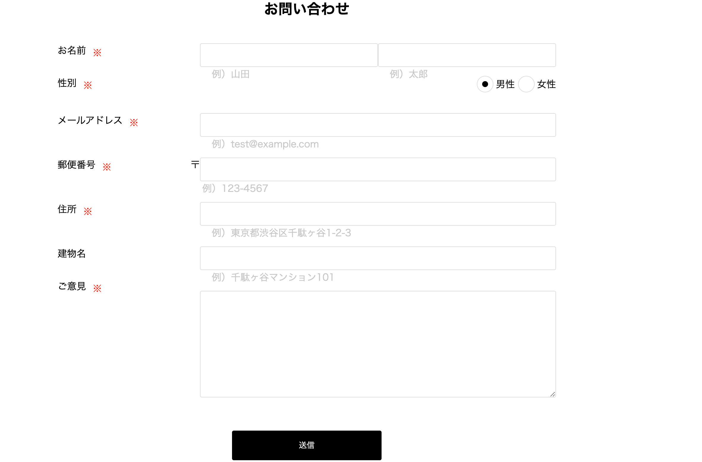
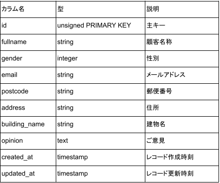
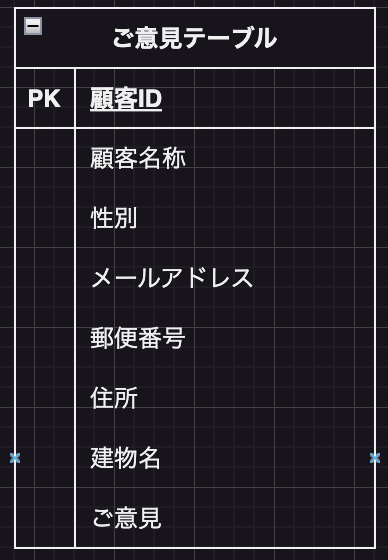

# お客様相談管理システム

## 作成した目的

お客様からのご意見をいただく窓口とし、この情報をもとにクレーム対応を行ったり、
今後のサービス向上に役立てるため。

## アプリケーション URL

http://localhost/

## 機能一覧

お客様からのご意見を、お客様情報と共にデータベースに登録する。
登録されたお客様情報を検索し、該当データを出力する。

## 使用技術（実行環境）

Laravel Framework 8.83.27

## テーブル設計

## ER 図

## 実装できなかった項目

・バリデーションの実装
method illuminate\validation\validator::validatetext does not exist.
というエラーか解消できなかったため。

・郵便番号による住所補完の実装

・性別データの表示
内容確認画面に継承した数字ではなく、「男性」「女性」と表記するため、
confirm.blade.php 内で@if を利用して実現したかったがシンタックスエラーが解消できなかった。

・内容確認画面の修正ボタンの実装
修正する処理が実装できず、現状では修正ボタンをクリックすると入力データがデータベースに登録されてしまう。

・管理システム画面の検索処理
項目の入力とリセットボタンは実装できたが、検索ボタンをクリックした後の検索処理、および検索結果を
出力する一連の処理を実装することができなかった。
